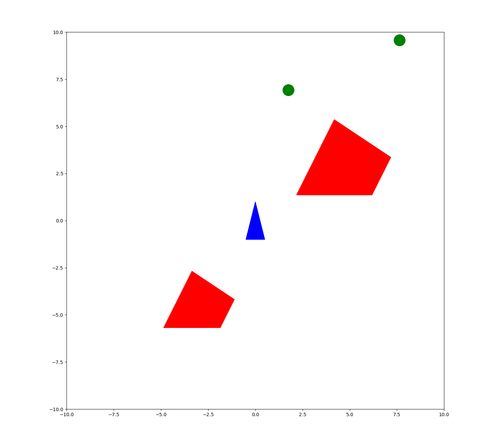

# Linear Algebra in Computer Graphics

## Overview
This project explores the application of **Linear Algebra** in **Computer Graphics**. It includes a detailed report on the key mathematical concepts, multiple Python implementations of graphical transformations, and a game built using linear algebra principles. The report has links to codes and outputs through google drive links. Howver the codes and output are also attached in this repo.

## Features
- **Report on Linear Algebra Applications**: A comprehensive report detailing the use of linear algebra in computer graphics, focusing on transformations like scaling, rotation, translation, and projection.
- **Python Implementations**: Multiple Python scripts demonstrating the practical use of linear algebra in graphical transformations and rendering.
- **Interactive Game**: A game built using linear algebra concepts, where the mathematical mechanics drive the movement and transformations of objects.

## Technologies Used
- **Python**: Core programming language used for implementations.
- **Matplotlib**: Library used for plotting and visualizing graphical transformations.

## Usage
- **Report and Videos**: There is a pdf file in this repo which is the report and some mp4 files showing some outputs. Download these to view them.
- **Graphical Transformations**: Run the Python scripts to see visual representations of linear algebra transformations in 2D/3D space.
- **Game**: Launch the game to interact with objects controlled by linear algebra principles like rotation, scaling, and translation.

### Game Instructions:
- Use the **up arrow key** to move the spaceship forward.
- Use the **down arrow key** to move the spaceship backward.
- Use the **left arrow key** to rotate the spaceship to the left.
- Use the **right arrow key** to rotate the spaceship to the right.
- **Collect power points** to increase your score.
- **Avoid crashing into asteroids**—each crash reduces your score.
- Reach **10 points** to win the game!

## Game Screenshot
Here’s a screenshot of the game in action:

  

